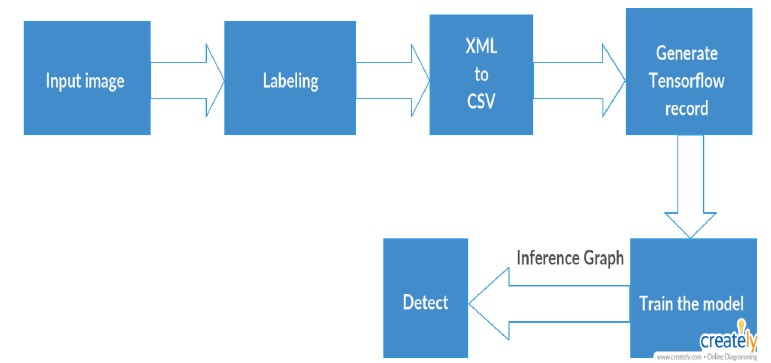
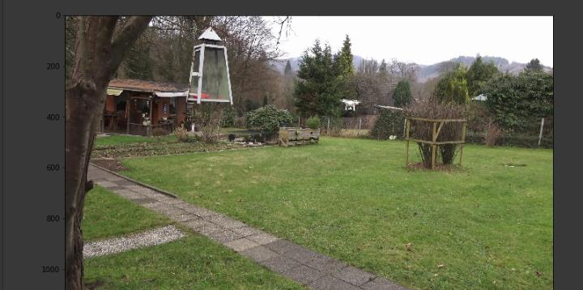

# Object-Detection-using-Machine-Learning
The objective of the project is to detect objects, primarily drones in clear weather condition.
## Methodology
The methodology that we are following in the project is: 
1. Acquiring required dataset- images of drones. 
2. Selection of region of interest, i.e. drone from the image and labelling. This step generates
a XML file for each image which contains information about the co-ordinates of the drone
in the image. 
3. Conversion of the XML files generated in the last step to CSV file. The CSV file is made
up by combining all the XML files. 
4. Conversion of CSV files to TF(TensorFlow) Record Files. Tensorflow uses the TF Record
files as input during the training. 
5. Training using Tensorflow. The TF Record files are used as input during the training. 
6. The detection model is obtained after training which then can be used for detection of
drones. 
## Block Diagram

## Dataset Description
Images taken from the internet and screenshots taken from videos are used as dataset. The
images comprises of different models of drone from different angles.
## Algorithms Used
We have two different algorithms in our project namely Single Shot MultiBox Detector (SSD)
and Faster R-CNN.
## Training
For training, we have used the process of transfer learning. It uses a pre-trained model to learn
a new object. The benefit of transfer learning is that training can be much quicker, and the
required data that you might need is much less. In the training, we have trained two types of
model. One is ssd_mobilenet_v1_coco which have a minimum average precision (mAP) of 21
and the other is faster_rcnn_nas which have a minimum average precision (mAP) of 43. The
higher the mAP, the more accurate is the result.
## Results
- <b>Faster rcnn nas model</b>  
Accuracy: (True Positives + True Negatives)/total images = (113+0)/116 = 0.97 
Misclassification Rate: (False Positives + False Negatives)/total images = (3+1)/116 = 0.03  
 
  
- <b>Ssd v1 coco</b>  
Accuracy:  (True Positives + True Negatives)/total images = (87+0)/116 = 0.75 
Misclassification Rate: (False Positives + False Negatives)/total image = (1+28)/116 = 0.25  
 
 

